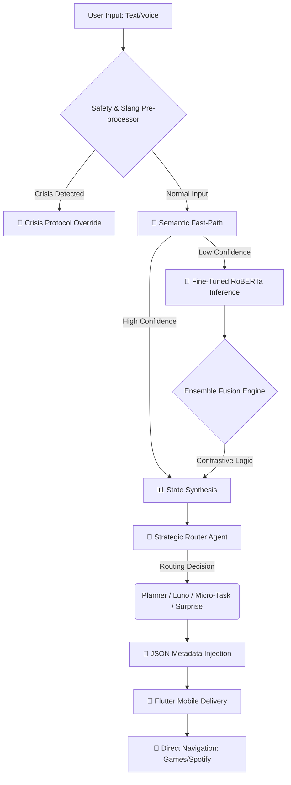

# 🚀 AI-Powered Boredom Breaker System
**An intelligent, mood-aware ecosystem designed to combat student burnout, stagnation, and emotional fatigue using Multi-Agent Orchestration and Fine-Tuned Transformers.**

---

## 📌 Project Overview
The **AI Boredom Breaker** is not just another distraction app. It is a clinical yet empathetic recovery system built to address the unique emotional landscape of modern students. By bridging deep emotional understanding with actionable behavioral interventions, the system doesn't just "kill time"—it actively diagnoses a user's emotional state and prescribes a recovery path (Grounded in CBT and Behavioral Activation principles).

Whether a user is experiencing **Restless Boredom** (high energy, no outlet) or **Cognitive Fatigue** (exhaustion masquerading as boredom), the system adapts its strategy to provide the right intervention at the right time.

---

## 🧠 The Brain: Fine-Tuning & Algorithms

### 1. Fine-Tuning Methodology & Training Data
We performed **Domain Adaptation** on a `RoBERTa-base` architecture to transform a general-purpose emotion model into a specialized student wellness engine.

#### The Training Pipeline & Dataset:
*   **Original Base Model**: `cardiffnlp/twitter-roberta-base-emotion`.
*   **The "What" (Datasets Used)**:
    *   **1. Primary Fine-Tuning Corpus (GoEmotions)**: We utilized a high-fidelity emotional dataset (~42MB `emotions.csv`) derived from **Google's GoEmotions** corpus, providing the foundation for 28+ nuanced emotional categories.
    *   **2. Domain-Specific Student Wellness Dataset**: A custom-curated dataset of ~1,500 high-signal samples focusing on:
        *   **Academic Burnout**: Specifically targeting "exam fatigue," "final week stress," and "cognitive exhaustion."
        *   **Student Life Cues**: Real-world expressions of first-person student experiences.
    *   **3. Slang & Cultural Lexicon**: A specialized training subset for **Gen Z behavioral markers** (e.g., "cooked," "doomscrolling," "mid," "touch grass") and **Multilingual Distress** markers (e.g., Tamil signals like "mudiyala").
    *   **4. Base Foundation (TweetEval)**: The underlying RoBERTa weights were pre-trained on the **cardiffnlp/twitter-roberta-base-emotion** dataset (trained on 58M tweets and TweetEval).
*   **The "How" (Technical Execution)**:
    *   **Frameworks**: Built using **Hugging Face Transformers** and **PyTorch**.
    *   **Techniques**: 
        *   **Weighted Cross-Entropy Loss**: Implemented to address class imbalance and prioritize high-risk distress signals.
        *   **Layer Freezing**: Initial transformer blocks were frozen to preserve linguistic knowledge, while the final classification layers were fine-tuned for domain specialization.
        *   **Fallback Resilience**: The system includes a dynamic loading mechanism that reverts to the base RoBERTa model if the fine-tuned weights (`models/fine_tuned_roberta`) are unavailable.

### 2. Core Algorithms
*   **Emotion Detection**: `Transformer Ensemble (RoBERTa)`. Understands context, sarcasm, and complex emotional shifts.
*   **Arcade Logic**: `Minimax Algorithm`. Powers the Tic-Tac-Toe AI with a recursive search, making it mathematically "unbeatable."
*   **Agentic Decisions**: `ReAct (Reason + Act) Pattern`. Agents "think" about the user's state before selecting tools (Spotify/Games).
*   **Metadata Integration**: `Regex Word-Boundary Heuristics`. Instantly extracts song/game titles from conversational text to inject deep-links for the frontend.

---

## 🤖 The Multi-Agent Ecosystem (CrewAI)
The system uses **CrewAI** to orchestrate specialized personas that collaborate to deliver context-aware interventions. Each agent is built using a **Modular Design Pattern**, ensuring distinct "System Prompts" and behavioral constraints.

| Agent | Role | Logic & Build |
| :--- | :--- | :--- |
| **🧠 Router Agent** | The Strategic Director | Analyzes mood intensity and risk level to decide the intervention type: **Plan**, **Chat**, or **Micro-Task**. |
| **🗓️ Planner Agent** | The Architect of Recovery | Designs 3-step recovery arcs (e.g., Grounding -> Processing -> Activation) utilizing Spotify/Arcade tools. |
| **💬 Luno (Chat Agent)** | The Empathetic Confidant | A conversational specialist for validation using CBT (Cognitive Behavioral Therapy) patterns. Built with multi-turn memory. |
| **⚡ Micro-Task Agent** | The Instant Win Specialist | Prescribes 60-second actions (stretches, breathing) for users with zero energy or high fatigue. |
| **🎁 Surprise Agent** | The Dopamine Booster | Delivers random interesting facts, riddles, or "Boredom Buster" surprises to break mental loops. |

---

## ✨ Features Checklist
*   ✅ **Real-time Mood Detection**: Fine-tuned RoBERTa transformer logic for nuanced student emotions.
*   ✅ **Smart Spotify Integration**: Auto-filtering of old music; only modern recovery tracks (2024-2025).
*   ✅ **Direct Navigation**: Intelligent buttons that launch specific songs or games with one tap.
*   ✅ **Lockbox Vault**: End-to-End Encrypted (E2EE) journaling for sensitive notes.
*   ✅ **Luno Voice Assistant**: Interactive bi-directional voice companion (STT/TTS).
*   ✅ **Crisis Override**: Instant access to verified helplines (e.g., Kiran) when distress is detected.
*   ✅ **Multilingual Support**: Distress detection in English and Tamil.
*   ✅ **Gen Z Slang Support**: Interprets modern slang to accurately map emotional weight.

---

## 🎮 Arcade Zone: The Game List
When the system detects `Restless Boredom`, it unlocks high-engagement games:
*   **Tic-Tac-Toe**: High-stakes AI using the **Minimax Algorithm**.
*   **Snake Evolution**: Classic reflex-based grounding.
*   **Aim Trainer**: Interactive focus and hand-eye coordination.
*   **Reaction Time**: High-speed cognitive engagement.
*   **Memory Flip**: Logic-based pattern recognition.
*   **Chimp Test**: Advanced visual sequence recall.
*   **Number Guess**: Quick, low-stakes decision breaks.
*   **Rock Paper Scissors**: Classic quick-play engagement.
*   **Visual Memory**: Pattern-based cognitive exercise.

---

## 📜 History & Personalization: How It Works
The **History Page** acts as a "Well-being Ledger," providing more than just logs.

### 1. Temporal Tracking
Every session (Mood Check, Journal, Chat) is saved with:
*   The detected **Emotion** and its **Intensity**.
*   The **Nervous System State** (Hyperaroused vs Hypoaroused).
*   User Energy levels at that specific timestamp.

### 2. Personalized Feedback Loop
Personalization isn't just a static setting; it's a dynamic loop:
*   **Context Injection**: Your past history is fed back into the **Agent Context**. When you chat with Luno, she "remembers" your recent struggles and tailors her tone.
*   **Pattern Recognition**: The system analyzes history to notice trends (e.g., "You're often stressed on Monday afternoons") and proactively adjusts agent personas to be more supportive during those predicted times.
*   **Adaptive Intervention**: If a user consistently ignores "Games" but engages with "Breathing," the Planner Agent adapts the weight of its future recommendations.

---

## 🔄 The Exact Technical Workflow
The system operates as a reactive pipeline that moves from emotional raw data to structured behavioral intervention.

### 🏛️ Visual Logic Flow


### 📋 Detailed Step-by-Step Execution
1.  **Input Ingestion**: The system captures user input through the **Flutter Mobile Interface** (Text or WebSpeech-powered Voice).
2.  **Safety & Context Prep**:
    *   **Multilingual Risk Scan**: Scans for distress in Tamil and English (Safety First).
    *   **Slang Normalization**: Maps terms like "cooked" or "doomscrolling" to energy/mood vectors.
3.  **Hybrid Emotion Intelligence**:
    *   **Phase 1 (Semantic)**: Instant keyword matching for 100+ high-signal clusters (Saves ~1s latency).
    *   **Phase 2 (Transformer)**: If Phase 1 is ambiguous, the **Fine-Tuned RoBERTa (v14)** processes the full context, detecting sarcasm and deep fatigue.
    *   **Phase 3 (Ensemble Fusion)**: Merges the two signals, preventing "neutrality bias" and ensuring confidence scoring is mathematically grounded.
4.  **Multi-Agent Orchestration (CrewAI)**:
    *   The **Router Agent** analyzes the `State` (Mood + Intensity + Risk).
    *   It selects a specialized worker:
        *   **Planner**: If the user needs a structured 3-step recovery arc.
        *   **Luno**: If the user needs therapeutic validation/active listening.
        *   **Micro-Task**: If the user is too exhausted for complex activities.
5.  **Post-Processing & Injection**: The response is scanned by **Regex Heuristics** to identify mentioned games or playlists, injecting functional metadata (IDs/URLs) into the final JSON payload.
6.  **Dynamic Rendering**: The Mobile app receives the payload and renders the **Action Center**, providing one-tap navigation to the Spotify Player or Arcade Games.

---

## 🚀 Getting Started

### 1. Backend Setup (FastAPI)
```bash
cd backend
python -m venv venv
source venv/bin/activate
pip install -r requirements.txt
uvicorn app.main:app --reload
```
*Note: The system preloads the ~500MB Transformer model on startup.*

### 2. Mobile Setup (Flutter)
```bash
cd boredom_breaker_mobile
flutter pub get
flutter run
```

### 3. Frontend Setup (React/Vite - Optional)
```bash
cd frontend
npm install
npm run dev
```

---
*Built for students, by code. Stability, Empathy, and Activation.*
