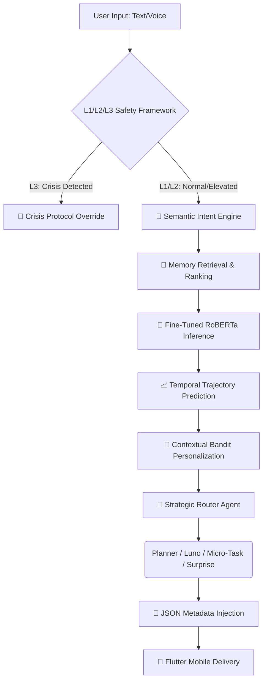

# 🚀 AI-Powered Boredom Breaker System
**A sophisticated, production-grade mood-aware ecosystem designed to combat student burnout, stagnation, and emotional fatigue using Multi-Agent Orchestration, Contextual Bandits, and Fine-Tuned Transformers.**

---

## 📌 Project Overview
The **AI Boredom Breaker** is not just another distraction app. It is a clinical yet empathetic recovery system built to address the unique emotional landscape of modern students. By bridging deep emotional understanding with actionable behavioral interventions, the system doesn't just "kill time"—it actively diagnoses a user's emotional state and prescribes a recovery path (Grounded in CBT and Behavioral Activation principles).

Whether a user is experiencing **Restless Boredom** (high energy, no outlet) or **Cognitive Fatigue** (exhaustion masquerading as boredom), the system adapts its strategy to provide the right intervention at the right time.

---

## 🧠 The Brain: Fine-Tuning & Algorithms

### 1. Fine-Tuning Methodology & Training Data
We performed **Domain Adaptation** on a `RoBERTa-base` architecture to transform a general-purpose emotion model into a specialized student wellness engine.

#### The Training Pipeline & Dataset:
*   **Original Base Model**: `cardiffnlp/twitter-roberta-base-emotion`.
*   **The "What" (Datasets Used)**:
    *   **1. Primary Fine-Tuning Corpus (GoEmotions)**: We utilized a high-fidelity emotional dataset (~42MB `emotions.csv`) derived from **Google's GoEmotions** corpus, providing the foundation for 28+ nuanced emotional categories.
    *   **2. Consolidatated V14 Master Corpus**: A custom-engineered dataset of thousands of high-signal samples that maps diverse emotions into a unified **6-Class Schema** (Joy, Sadness, Anger, Fear, Neutral, Boredom).
    *   **3. Student Wellness Specialization**: Real-world academic data specifically targeting "exam fatigue," "final week stress," and "cognitive exhaustion," enabling the model to distinguish between general sadness and academic burnout.
    *   **4. Slang & Cultural Lexicon**: A specialized training subset for **Gen Z behavioral markers** (e.g., "cooked," "doomscrolling," "mid") and **Multilingual Distress** markers (e.g., Tamil signals like "mudiyala").
*   **The "How" (Technical Execution)**:
    *   **Frameworks**: Built using **Hugging Face Transformers**, **PyTorch**, and **scikit-learn**.
    *   **Training Parameters**: 
        *   **Version 14 Final**: Fine-tuned over 5 epochs with a learning rate of `1e-5` and a batch size of 16.
        *   **Optimization**: Optimized using **AdamW** with a weight decay of 0.01 and **Early Stopping** to prevent overfitting.
        *   **Evaluation Metric**: Primary metric is **Weighted F1-Score** to ensure class-balanced sensitivity.
    *   **Verified Metrics (V14 Final)**:
        *   ✅ **Accuracy**: **98.16%**
        *   ✅ **F1-Score**: **98.16%**
        *   ✅ **Convergence**: Best model saved at Checkpoint 92 (Epoch 1) with an eval loss of 0.12.

### 2. Core Algorithms & AI Architecture
The system uses a sophisticated "Multi-Engine" architecture, bridging deterministic logic with probabilistic learning.

| Category | Algorithm / Model | Purpose |
| :--- | :--- | :--- |
| **Emotion AI** | **RoBERTa (V14 Final)** | Transformer-based classification with 98.16% F1-score for high-fidelity mood sensing. |
| **Personalization** | **Thompson Sampling (Bandit)** | A Contextual Bandit learner that optimizes interventions (e.g., Games vs. Music) based on historical success. |
| **Semantic Intent** | **Cosine Similarity (Embeddings)** | Uses Vector Space Analysis to identify user requests (e.g., "Give me a game") without fragile keyword matching. |
| **Arcade AI** | **Minimax Algorithm** | Powers the optimal move selection in Tic-Tac-Toe, ensuring a "perfect" opponent. |
| **Memory Extraction** | **Vector Search (ChromaDB)** | Retrieves the most relevant past interactions based on semantic distance and emotional intensity. |
| **Trajectory Analysis** | **Linear Projection & Sequence Analysis** | Detects emotional "burnout paths" by analyzing the delta between the last 10 interactions. |
| **Orchestration** | **Multi-Agent Systems (CrewAI)** | Autonomous agents (Router, Planner, Luno) performing task-decomposition and response planning. |
| **Safety** | **L1/L2 Hard Blocking + LLM Verification** | A tiered hybrid of regex, transformers, and semantic scan for crisis prevention. |

### 3. Advanced Intelligence Upgrades (V2 Roadmap)
Beyond standard classification, the system implements **Principal-Level AI Patterns**:

*   **Temporal Trajectory Prediction**: Uses **Linear Projection & Sequence Analysis** on the last 10 interactions to predict future emotional states (e.g., detecting if a user is on a "Burnout Path" before they reach it).
*   **Embeddings Cache**: Implemented an in-memory LRU cache for text embeddings to reduce CPU/GPU latency for frequent student expressions.
*   **Arcade Logic**: `Minimax Algorithm`. Powers the recursive search in Tic-Tac-Toe to ensure a challenge.

---

## 🤖 The Multi-Agent Ecosystem (CrewAI)
The system uses **CrewAI** to orchestrate specialized personas that collaborate to deliver context-aware interventions. Each agent is built using a **Modular Design Pattern**, ensuring distinct "System Prompts" and behavioral constraints.

| Agent | Role | Logic & Build |
| :--- | :--- | :--- |
| **🧠 Router Agent** | The Strategic Director | Analyzes mood intensity and risk level to decide the intervention type: **Plan**, **Chat**, or **Micro-Task**. |
| **🗓️ Planner Agent** | The Architect of Recovery | Designs 3-step recovery arcs (e.g., Grounding -> Processing -> Activation) utilizing Spotify/Arcade tools. |
| **💬 Luno (Chat Agent)** | The Empathetic Confidant | A conversational specialist for validation using CBT (Cognitive Behavioral Therapy) patterns. Built with multi-turn memory. |
| **⚡ Micro-Task Agent** | The Instant Win Specialist | Prescribes 60-second actions (stretches, breathing) for users with zero energy or high fatigue. |
| **🎁 Surprise Agent** | The Dopamine Booster | Delivers random interesting facts, riddles, or "Boredom Buster" surprises to break mental loops. |

---

## ✨ Features Checklist
*   ✅ **Real-time Mood Detection**: Fine-tuned RoBERTa transformer logic for nuanced student emotions.
*   ✅ **Contextual Personalization**: Thompson Sampling bandits for adaptive interventions.
*   ✅ **Semantic Long-term Memory**: Vector-based recall ranked by recency and intensity.
*   ✅ **Burnout Prediction**: Temporal trajectory analysis to detect emotional escalation.
*   ✅ **Multi-layer Safety (L1/L2/L3)**: Production-grade crisis detection and escalation framework.
*   ✅ **Smart Spotify Integration**: Auto-filtering of old music; only modern recovery tracks (2024-2025).
*   ✅ **Direct Navigation**: Intelligent buttons that launch specific songs or games with one tap.
*   ✅ **Lockbox Vault**: End-to-End Encrypted (E2EE) journaling for sensitive notes.
*   ✅ **Luno Voice Assistant**: Interactive bi-directional voice companion (STT/TTS).
*   ✅ **Multilingual Support**: Distress detection in English and Tamil.

---

## 🎮 Arcade Zone: The Game List
When the system detects `Restless Boredom`, it unlocks high-engagement games:
*   **Tic-Tac-Toe**: High-stakes AI using the **Minimax Algorithm**.
*   **Snake Evolution**: Classic reflex-based grounding.
*   **Aim Trainer**: Interactive focus and hand-eye coordination.
*   **Reaction Time**: High-speed cognitive engagement.
*   **Memory Flip**: Logic-based pattern recognition.
*   **Chimp Test**: Advanced visual sequence recall.
*   **Number Guess**: Quick, low-stakes decision breaks.
*   **Rock Paper Scissors**: Classic quick-play engagement.
*   **Visual Memory**: Pattern-based cognitive exercise.

---

## 📜 History & Personalization: How It Works
The **History Page** acts as a "Well-being Ledger," providing more than just logs.

### 1. Temporal Tracking
Every session (Mood Check, Journal, Chat) is saved with:
*   The detected **Emotion** and its **Intensity**.
*   The **Nervous System State** (Hyperaroused vs Hypoaroused).
*   User Energy levels at that specific timestamp.

### 2. Personalized Feedback Loop
Personalization isn't just a static setting; it's a dynamic loop:
*   **Context Injection**: Your past history is fed back into the **Agent Context**. When you chat with Luno, she "remembers" your recent struggles and tailors her tone.
*   **Pattern Recognition**: The system analyzes history to notice trends (e.g., "You're often stressed on Monday afternoons") and proactively adjusts agent personas to be more supportive during those predicted times.
*   **Adaptive Intervention**: If a user consistently ignores "Games" but engages with "Breathing," the Planner Agent adapts the weight of its future recommendations.

---

## 🔄 The Exact Technical Workflow
The system operates as a reactive pipeline that moves from emotional raw data to structured behavioral intervention.

### 🏛️ Visual Logic Flow


### 📋 Detailed Step-by-Step Execution
1.  **Input Ingestion**: User provides input via the **Flutter Mobile Interface** (Text or Voice).
2.  **L1/L2/L3 Safety Framework**:
    *   **Level 1**: Keyword check.
    *   **Level 2**: Transformer classification.
    *   **Level 3**: **LLM Semantic Safety Scan**. If critical risk detected, the "Crisis Protocol" triggers, disabling high-energy tasks and providing emergency helplines.
3.  **Intelligence Pipeline**:
    *   **Semantic Intent Engine**: Replaces fragile logic with **Sentence Embeddings** to understand user goals immediately.
    *   **Memory Ranking**: Retrieves history from **ChromaDB**, ranking entries by recency, emotional intensity, and similarity.
    *   **Temporal Prediction**: Analyzes the emotional arc to detect **Burnout or Recovery** trends.
4.  **Contextual Personalization**: The **Thompson Sampling Bandit** selects the optimal intervention (e.g., game vs. breathing) based on the user's current energy, time of day, and historical success.
5.  **Multi-Agent Execution**: **CrewAI** orchestrates the selected agent (Planner/Luno/etc.) using the enriched context.
6.  **Metadata Injection & Delivery**: Mentions of games or music are converted into deep-links and delivered to the Flutter app for one-tap navigation.

---

## 🚀 Getting Started

### 1. Backend Setup (FastAPI)
```bash
cd backend
python -m venv venv
source venv/bin/activate
pip install -r requirements.txt
uvicorn app.main:app --reload
```
*Note: The system preloads the ~500MB Transformer model on startup.*

### 2. Mobile Setup (Flutter)
```bash
cd boredom_breaker_mobile
flutter pub get
flutter run
# To run directly on the iPhone 17 Pro simulator
flutter run -d "iPhone 17 Pro"
flutter run -d 95D9C2C4-A38D-4C90-91F0-601927990D1B
xcrun simctl boot 95D9C2C4-A38D-4C90-91F0-601927990D1B
open -a Simulator


```

### 3. Frontend Setup (React/Vite - Optional)
```bash
cd frontend
npm install
npm run dev
```

---
*Built for students, by code. Stability, Empathy, and Activation.*
